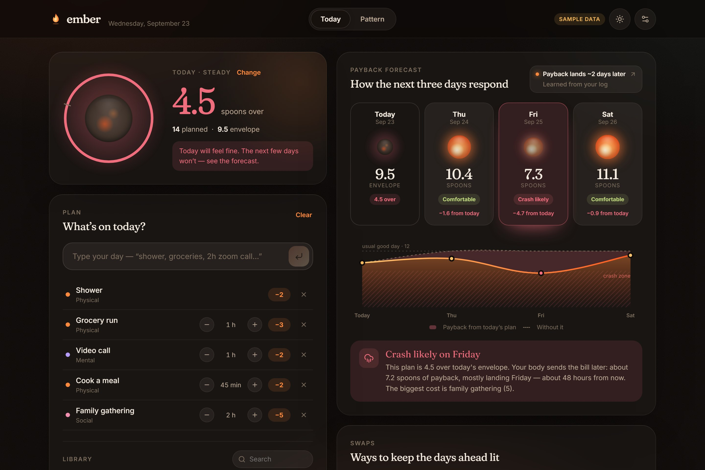
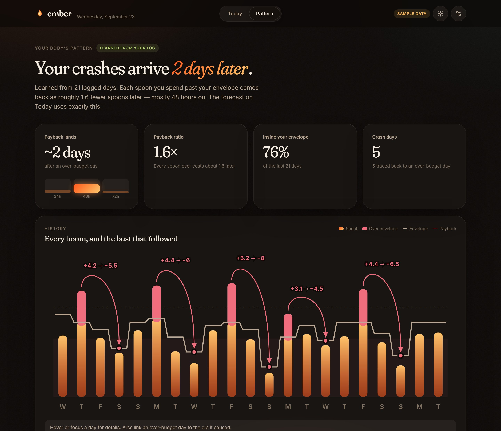
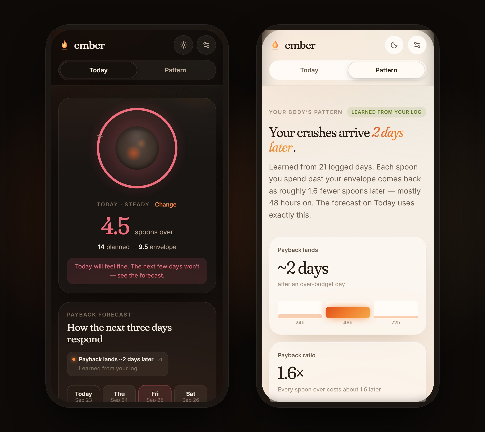

<div align="center">


# Ember

**See tomorrow's crash before you spend today.**

A pacing planner for people living with ME/CFS, Long COVID and other energy-limiting illness.<br/>
Plan your day and watch the next three days respond — before your body sends the bill.

**[Try it live → ember-pacing.vercel.app](https://ember-pacing.vercel.app)**

<br/>



</div>

<br/>

## The problem

For people with post-exertional malaise, overdoing it doesn't hurt today. It hurts **one to three days later**. A grocery run and a birthday party on Tuesday can mean a lost Thursday and Friday, and by the time the crash arrives, the cause is long gone.

Clinicians prescribe *pacing*: staying inside your "energy envelope". In practice, pacing is done by feel, in a notes app, with a spoon count that only looks at today. The tools that exist look **backwards**. Symptom diaries record the crash after it happens, and wearables give you a score for this morning.

Nothing shows you what today's plan will cost you on Friday.

## What Ember does

Ember looks **forward**. As you build today's plan, it projects the delayed payback onto the next three days, using a pattern it learns from your own history.

| | |
|---|---|
| **Check in** | A ten-second morning check-in sets today's envelope in spoons. |
| **Plan in plain words** | Type *"shower, groceries, 1h zoom call, cook dinner"*, or tap from a library of 30+ everyday activities. Durations rescale costs, and rest gives spoons back. |
| **See the payback** | A live four-day forecast shows each day's projected envelope. Go over budget and Friday dims, with a plain-language reason: what caused it, how much, and when it lands. |
| **Fix it before it happens** | Ember simulates every reasonable change (a lighter version, splitting with a rest, moving to another day) and suggests the three that most protect the days ahead. |
| **Learn your lag** | The Pattern view fits *your* crash delay and payback ratio from your log, and draws every over-budget day with an arc to the dip that followed. |

<br/>

<div align="center">

</div>

## How the forecast works

Ember's model is deliberately small, transparent and explainable in a sentence.

**Overspend.** Each day, the spoons spent beyond that day's envelope:

```
over(d) = max(0, spent(d) − envelope(d))
```

**Payback.** Overspend comes back as a smaller envelope on the following days, spread across a personal lag profile:

```
envelope(d + k) = usual − ratio · w[k] · over(d)      for k = 1, 2, 3
```

**Learning.** From the logged history, Ember fits how far each morning fell below the usual budget against the overspend one, two and three days earlier:

```
dip(d) ≈ c + β₁·over(d−1) + β₂·over(d−2) + β₃·over(d−3)
```

It uses ridge-regularised least squares, so the weights stay stable even with a few weeks of noisy data. `w = β / Σβ` gives *when* the payback lands and `ratio = Σβ` gives *how much*. Until seven days are logged, Ember uses research-informed defaults (most payback within 24–48 hours). It blends towards the personal fit as confidence grows.

A unit test generates noisy history from a known pattern (peak lag of two days, ratio 1.7) and checks that the fit recovers it.

## Designed for low-energy days

<div align="center">

</div>

<br/>

- **Night-first.** Light sensitivity is common in this community, so a warm, low-glare dark theme is the default. A soft Daylight theme follows the system or can be chosen manually.
- **Low cognitive load.** One screen for the day, large tap targets, plain language, and no streaks, scores or guilt.
- **Calm motion.** The ember glows and dims gently, and every animation respects `prefers-reduced-motion`.
- **Accessible.** Semantic landmarks, labelled controls, keyboard-navigable charts, and live regions for forecast changes.

## Private by design

There is no account, no server and no analytics. Everything stays in your browser's local storage. The forecast, the learning and the quick-add parser all run on your device. Clearing your data takes one tap in Settings.

## Built with

- [React 19](https://react.dev) and [TypeScript](https://www.typescriptlang.org), bundled with [Vite](https://vite.dev)
- [Motion](https://motion.dev) for spring animation
- Hand-drawn SVG charts, with no chart library
- Self-hosted [Fraunces](https://fonts.google.com/specimen/Fraunces) and [Inter](https://rsms.me/inter/) variable fonts via [Fontsource](https://fontsource.org)
- [Vitest](https://vitest.dev) for the model and state tests

## Running locally

Requires Node.js 20 or newer.

```bash
npm install
npm run dev      # http://localhost:5173
npm test         # model and state unit tests
npm run build    # static production build in dist/
```

Choose **Explore with sample history** on the welcome screen to load 21 days of clearly labelled sample data.

## Project structure

```
src/
├── model/        Pure, tested logic: forecast, learning, quick add, swaps, sample data
├── state/        App state, local persistence and day rollover
├── components/   Screens and UI: Welcome, Today, Pattern, Settings, charts, ember orb
└── styles/       Design tokens (Night and Daylight) and component styles
devpost/          Product planning: scope, requirements, technical spec, build checklist
```

The planning documents in [`devpost/`](devpost) ([scope](devpost/scope.md), [PRD](devpost/prd.md), [spec](devpost/spec.md), [build checklist](devpost/checklist.md)) record how Ember was scoped and built, including the decisions and revisions made along the way.

## A note on health

Ember is a planning aid, not a medical device. Its forecast is a simple model learned from your own entries, and it does not diagnose or treat any condition. Always follow the guidance of your clinician.

*Spoons* are the community's unit of energy, from Christine Miserandino's [Spoon Theory](https://butyoudontlooksick.com/articles/written-by-christine/the-spoon-theory/). For more on pacing, see the [Patient-Led Research Collaborative's pacing guide](https://patientresearchcovid19.com/clinicians-pacing-and-management-guide-for-me-cfs-and-long-covid/) and the [CDC's guidance on post-exertional malaise](https://www.cdc.gov/me-cfs/hcp/clinical-care/treating-the-most-disruptive-symptoms-first-and-preventing-worsening-of-symptoms.html).

## License

[MIT](LICENSE)
